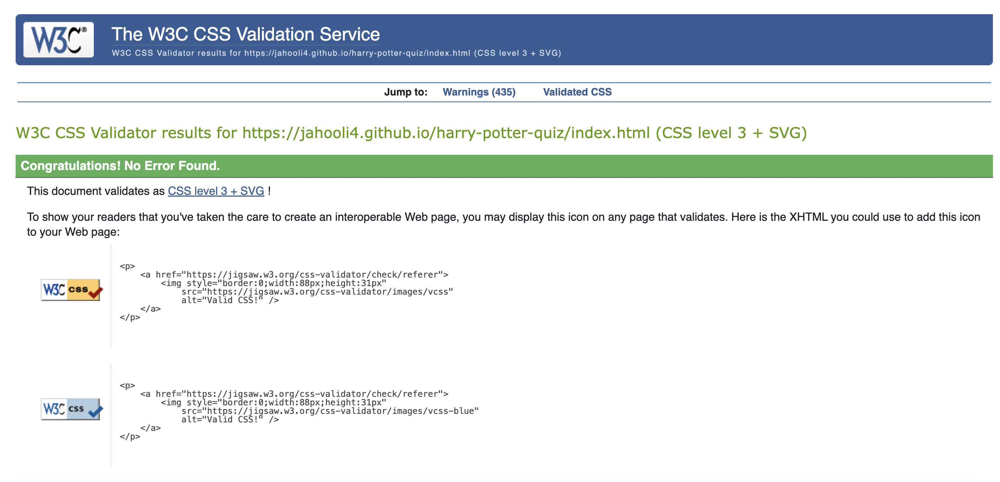

# Harry Potter Quiz ⚡

[Live site](https://jahooli4.github.io/harry-potter-quiz/index.html)

The Harry Potter Quiz is a fun game for fans who wish to test their knowledge on wizarding world trivia. The questions are based on a combination of the books and films. 

The user is invited to select their Hogwarts house which will change the background colour of the game based on their choice.

The user can then select from three levels of difficulty: easy, medium or difficult. This ensures that the game is inclusive to all players, whether the user is new to the series or a long time fan.

 

## User Experience (UX)

### **User Stories:**

### User
  > - As a user I want to be able to play a fun and engaging game.
  > - As a user I want to test my knowledge on the Harry Potter series.
  > - As a user I want to intuitively navigate the site without confusion.
  > - As a user I want to be able to choose a difficulty level.
  > - As a user I want to be able to see a running score as the game progresses.
  > - As a user I want to see my final score when I have completed the quiz.

### Quiz site Owner
  > - As the site owner I want to provide a fun and engaging quiz for the user.
  > - As the site owner I want the user to be able to replay the game multiple times.
  > - As the site owner I want to be able to add or remove questions from the quiz.

### Scope Plane
  > - The website should have a link to the home page visible at all times so the user can reset the quiz without using browser navigation buttons.
  > - The website should have a welcome message for the user that concisely describes the purpose of the site.
  > - The website should be visually appealing to the user and be styled in a way that is relevant to the Harry Potter theme.
  > - The website background should change colour when the user selects their house.
  > - The website should give the user a choice in level difficulty for the quiz.
  > - The website should keep a running total of the user's score and display this to them.
  > - The website should let the user know whether they have selected the correct answer or not.
  > - The website should display the user's total score and an end of quiz message after 10 questions have been answered.

## Structure Plane 
### (All 'pages' are on one site page and are hidden or displayed via display: block/hidden css)

> - Site logo/title

Home page
> - Welcome message that briefly describes quiz
> - User is invited to choose their Hogwarts house via buttons (background changes colour once selected and Level options appear)
> - Level selection options (Easy, Medium, Difficult)
> - Photo of the main characters as background.

Quiz page
> - Level difficulty based on user selection
> - Randomly generated question
> - 4 answer buttons with hover effects
> - Running score (score/current question number)

End game page
> - Final score is displayed out of 10
> - End of game message is displayed (generated based on score)
> - 'Play again' button to encourage user to restart the game or try a new level.

### Wireframes:

Homepage:

Quiz page:

End game page:

The site has been designed to be as user friendly as possible, utilising a classic layout style with the title/logo at the top that links to the home page, central main content, and footer with external social media links at the bottom. The layout has been made as consistent as possible across devices of different sizes, with elements only rearranging to provide optimised viewing.

### Surface plane

**Color**
With regards to the main colour scheme of the site I have decided to opt for the classic red, green, blue and yellow colours of the Hogwarts houses for the optional background colours, aswell as for the answer selection buttons. To ensure these colours pop I have chosen a classic purple colour for the background as I think this allows sufficient contrast without being aesthetically jarring.
> - #fafafa (white)
> - #800080 (purple)
> - #eeba30 (yellow)
> - #0041c2 (blue)
> - #b22222 (red)
> - #198754 (green)

Colour palette generated from coolors.co

**Font:**
The main font for the quiz will be "Old Standard TT" and for the main page title/logo and other smaller headings I will use "MedievalSharp" as this is the closest I could find to the fonts used on the Harry Potter book covers. I think the two fonts complement eachother nicely and are easily legible.

## Existing Features
> - Title/logo

Linked to homepage so user may refresh the quiz whenever they please, visible throughout the quiz.

> - House selection

User is invited to select their Hogwarts house of choice.

The background and logo change colour accordingly using JS.

User can then choose level difficulty for the quiz from the buttons.

> - Quiz questions and answers

Questions are pulled from the relevant array (easy, medium, difficult).

Answer buttons highlight when hovered over (large devices) to create positive UX.

Score increments +1 with every correct answer, scored out of the current question number (score/question number)

After user has selected an answer, the alert box appears to let user knopw whether their choice was correct or not.

> - Endgame page 

After 10 questions in any of the levels, the user's score is displayed with the relevent message based on how well they did.

The 'play again' button appears to invite the user to attempt another level.

> - Footer section

Minimal in design so as not to distract from the main quiz. I have included basic social media links in a place that is intuitive to the user.

## Future Features
### Home page
> - I would like to include some sort of animation on page load to add a more 3d feel to the site.
### Quiz section
> - Given more time I would like to add some sort of audio when the user selects an answer, with different noises based on whether the answer is correct or not.
### Additional pages
> - In the future I would plan to add a leaderboard feature that would allow users to create a username and appear on a page of high scorers.

## Languages used

> - HTML5
> - CSS3
> - Javascript

## Technologies used
> - Bootstrap: I used Bootstrap to help build my site in a responsive layout. (https://getbootstrap.com/docs/5.3/getting-started/)
> - Google Fonts: The font 'Old Standard TT' was used for the main body of the site. The font 'MedievalSharp' was used for the Logo and smaller titles.
> - Font Awesome: was used to import icons into the footer for the social media links.
> - Git: I used Gitpod as a code space to create the site from which I pushed my site to Github for deployment.
> - GitHub: I used GitHub as the respository for the projects code after being pushed from Gitpod.
> - Balsamiq: I used Balsamiq to create wireframes to outline to design of the site.
> - Coolor: I used coolor.co to generate a colour palette.

## Testing

### User testing
| Feature being tested:| Steps                                | Expected outcome  | Pass/Fail |
|:---------------------|:-------------------------------------|:------------------|-----|
| Navigation - Logo | Click the quiz logo on every page. | The logo should link the user back to the homepage, should be active on every page.           | PASS |
| Home page - UX | Read through the text. | It should be obvious to any user that the site is a quiz from reading the front page. | PASS |
| Home page - Hogwarts house banner buttons | Click each house button. | Each button should change the background colour and logo colour of the site. | PASS |
| Home page - Level selection buttons | Click each level button. | The quiz should begin on the relevant difficulty selected with the correct level title and questions. | PASS |
| Quiz page - Questions | Play quiz the whole way through each level. | Questions should be randomly generated and relevant to the level selected. No repeated questions. | PASS |
| Quiz page - Answer buttons | Hover mouse over buttons/Tap on mobile device. | Buttons should highlight when hovered and select the answer when clicked. New question should then be generated. | PASS |
| Quiz page - UX | Read through every question. | Text should all be clear and easily readable and the questions make sense. | PASS|
| Quiz page - score/question counter | Play quiz whole way through on each level. | Score should incrememnt by 1 for every correct answer and the question counter increment by 1 for every new question. | PASS |
| Footer - Social media icons | Click each one, test on each page. | Each link should change colour when hovered over and open in a new tab when clicked. | PASS |
| End game page - finish message | Complete quiz with each possible score. | End game message should alter based on score. Text should be clear and legible. | PASS |
| End game poge - Play again button | Click button | Quiz should reset back to the beginning | PASS| 
| Responsiveness - UX | Resize site for all device sizes. | Check that images/text/other elements resize as expected, text should be readable and elements should all be visible and not overlap randomly. Repeat for every page. | PASS|

### User testing Challenge

I sent my website to 5 users and asked them to complete the following tasks:

| Test |	Answered correctly: |
|:-----|:---------|
|Upon arrival to website is the purpose of the site obvious? | 5/5 yes |
|Please navigate to the facebook social |	5/5 |
|Please select your house + game level |	5/5 |
|Asked users whether they could easily see where their score is | 5/5 yes |

## Lighthouse Testing:

## HTML validator:

## CSS validator:

## JavaScript validator:

## Bugs: 

> - I had trouble with the bootstrap buttons I was using to display the answer choices. For some reason the hover effect lingered on mobile devices, meaning the previously selected answer remained highlighted even when the next question was displayed. 
> - As this was only happening on touch devices I decided to add a media query that removes the hover effect on anything smaller than a large device.

## Deployment

The steps to deploy the project are as follows:

1. Clicked on Settings on the navigation menu in the repository
2. I then selected the Pages menu on the side bar.
3. In the first dropdown menu labeled Source I selected the branch of the name 'main' from the dropdown.
4. In the next dropdown menu I left '/root' as the default option.
5. Selected Save
6. After 2-3 minute my project was live

7. Should you wish to add your own custom domain name you would have to purchase one with an external provider and enter it in the box towards the bottom of the page above.
